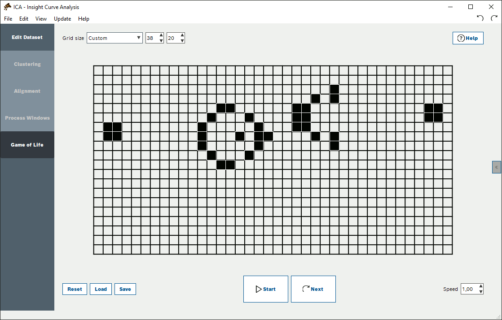
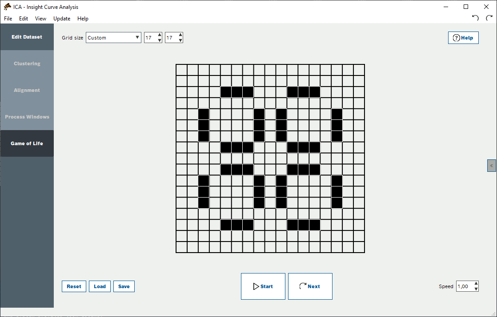

# MainGameOfLife

Python PyQt implementation of Conway's Game of Life.

You can find more about Conway's Game of Life and some examples on [Wikipedia](https://en.wikipedia.org/wiki/Conway's_Game_of_Life).

<h2>Installation</h2>

<h3>Clone repository</h3>

Might work with variety of Python version as long as the package versions specified in `requirements.txt` are available for your Python version.

```
$ git clone https://github.com/1000101cz/game_of_life
$ cd game_of_life
$ pip install -r requirements.txt  # Install python requirements
$ python main.py  # start the application
```

<h3>Install using pip</h3>

Installation using pip requires Python 3.11+

```
$ pip install git+https://github.com/1000101cz/game_of_life.git 
$ python
Python 3.11.9 (main, Apr 19 2024, 16:48:06) [GCC 11.2.0] on linux
Type "help", "copyright", "credits" or "license" for more information.

>>> import game_of_life
>>> game_of_life.start()
```

<h2>Load and save presets</h2>

The game comes with three predefined game grid presets

- glider
- gosper_glider_gun
- pulsar

You can load them by clicking on the Load button in the bottom left corner.

You can save any grid state as your own preset using the Save button.

<h2>Rules</h2>

1. Any live cell with fewer than two live neighbors dies, as if by underpopulation.
2. Any live cell with two or three live neighbors lives on to the next generation.
3. Any live cell with more than three live neighbors dies, as if by overpopulation.
4. Any dead cell with exactly three live neighbors becomes a live cell, as if by reproduction.

<h2>Galery</h2>




